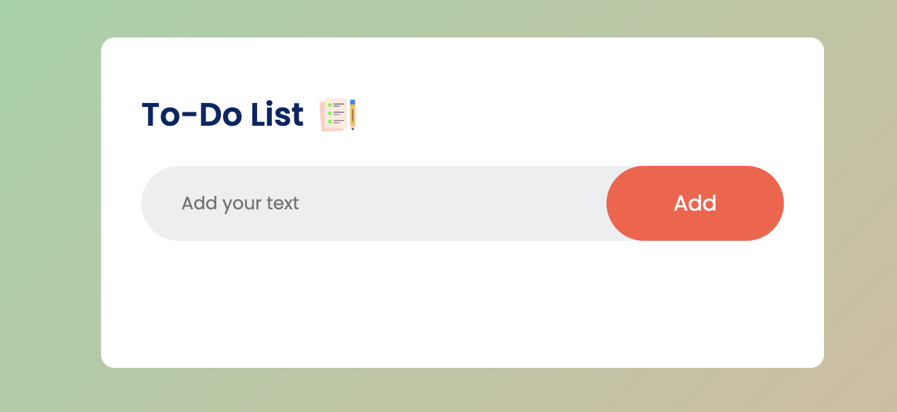
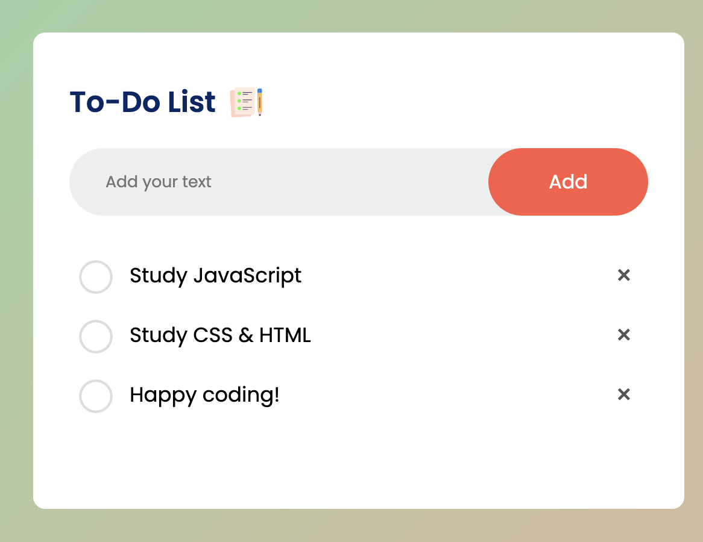
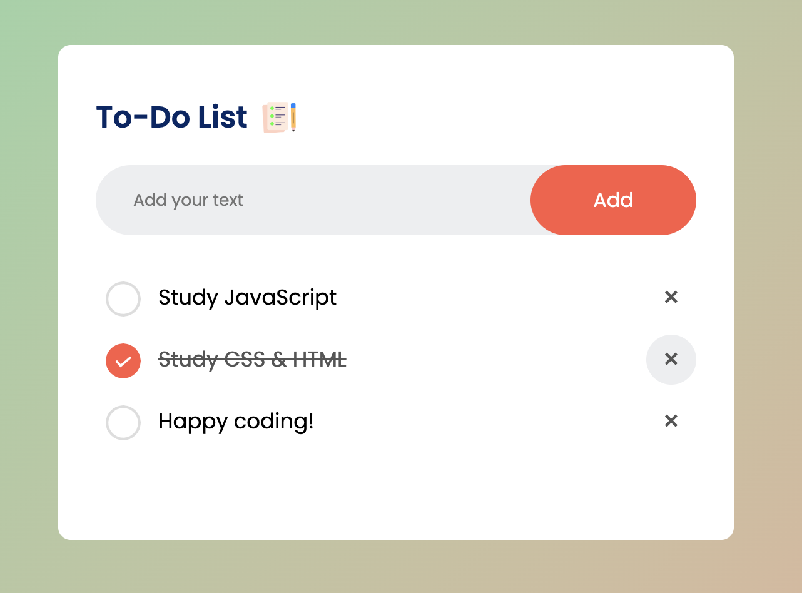
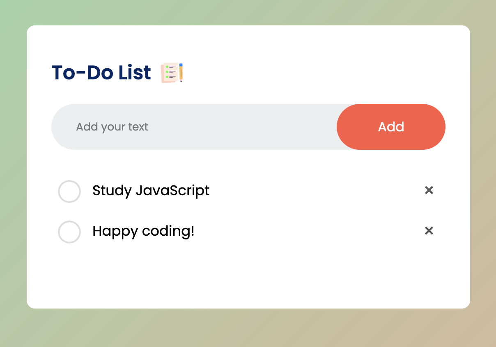

# todo-list-app

Simple To-do list app:

	•	Add tasks to the To-Do list using the input box and “Add” button.
	•	Click on a task to mark it as completed or incomplete.
	•	Delete tasks by clicking the close icon next to each task.
	•	Tasks are stored in Local Storage, so your list persists even after closing and reopening the browser.

    Enjoy =^..^=
 
 The app:
 

Adding tasks to the list:
 

Mark as checked:

 Updated list:

